# AWS VPC with Public and Private Subnets + EC2

A hands-on AWS networking project built manually in the AWS Management Console (us-east-1). It sets up a custom VPC with a public subnet and a private subnet, an internet gateway, separate route tables, and one Windows EC2 instance in each subnet.

## Architecture

| Component | Configuration |
|---|---|
| Region | us-east-1 (N. Virginia) |
| VPC | `10.0.0.0/24` |
| Public subnet | `10.0.0.0/26` |
| Private subnet | `10.0.0.64/26` |
| Internet gateway | Attached to the VPC |
| Public route table | `10.0.0.0/24 → local`, `0.0.0.0/0 → Internet Gateway`, associated with the public subnet |
| Private route table | `10.0.0.0/24 → local` only (no internet route), associated with the private subnet |
| EC2 (public) | Windows, t3.micro, in the public subnet, auto-assigned public IPv4 |
| EC2 (private) | Windows, t3.micro, in the private subnet, no public IP |

```
                 Internet
                    |
             [Internet Gateway]
                    |
   +----------------+------------------------------+
   | VPC 10.0.0.0/24                               |
   |                                               |
   |  Public subnet 10.0.0.0/26                    |
   |    Public RT: 0.0.0.0/0 -> IGW                |
   |    [ EC2: Public Machine ]                    |
   |                                               |
   |  Private subnet 10.0.0.64/26                  |
   |    Private RT: local only                     |
   |    [ EC2: Private Machine ]                   |
   +-----------------------------------------------+
```

## How it works

- **Public subnet:** its route table sends `0.0.0.0/0` to the internet gateway, and its instance has a public IPv4 address, so it can be reached from the internet.
- **Private subnet:** its route table has only the local route, so its instance has no direct path to or from the internet. It is reachable only from inside the VPC.
- **Security group:** RDP (port 3389) is allowed only from my own IP address (not `0.0.0.0/0`). A second rule allows traffic between instances that share the security group, so the two machines can communicate over private IPs.

## Steps performed

1. Created the VPC (`10.0.0.0/24`).
2. Created two subnets: public (`10.0.0.0/26`) and private (`10.0.0.64/26`).
3. Created an internet gateway and attached it to the VPC.
4. Created a public route table with a `0.0.0.0/0` route to the internet gateway and associated it with the public subnet.
5. Kept the private subnet on a route table with only the local route.
6. Launched a Windows t3.micro instance in each subnet (public IP on the public one only).
7. Restricted RDP in the security group to my IP.
8. Connected to the public machine over RDP.

## Issues faced and fixes

- **Both subnets were on the same route table**, which would have made the private subnet routable to the internet. Fixed by creating separate Public and Private route tables and associating each subnet with its own.
- **After moving the subnets, the public route table had no internet route.** The `0.0.0.0/0 → internet gateway` route had to be added explicitly to the new public route table.
- **RDP and SSH were open to `0.0.0.0/0`.** Tightened RDP to my IP only and removed the unneeded SSH rule.

## Screenshots

**VPC**

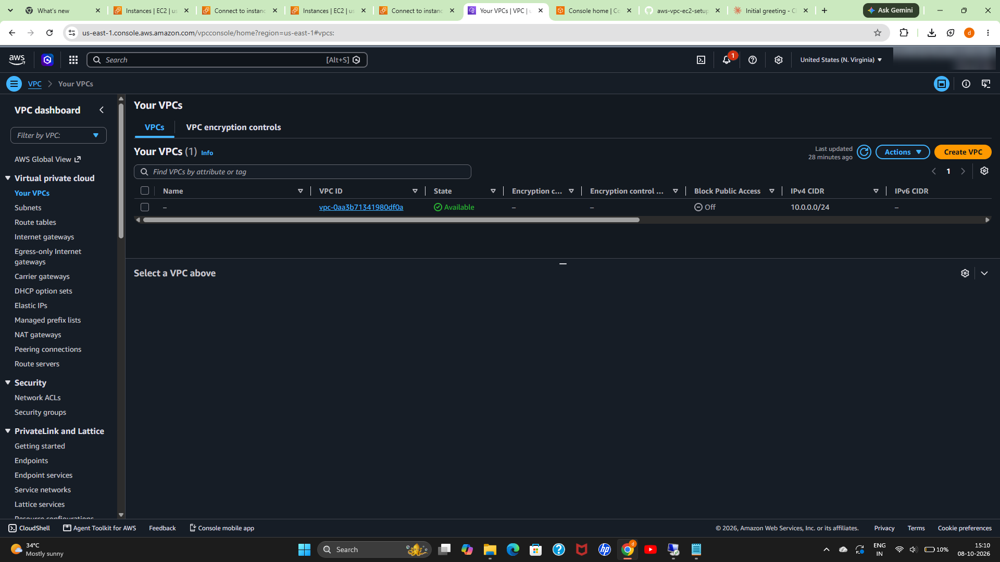

**Subnets** (public `10.0.0.0/26`, private `10.0.0.64/26`)

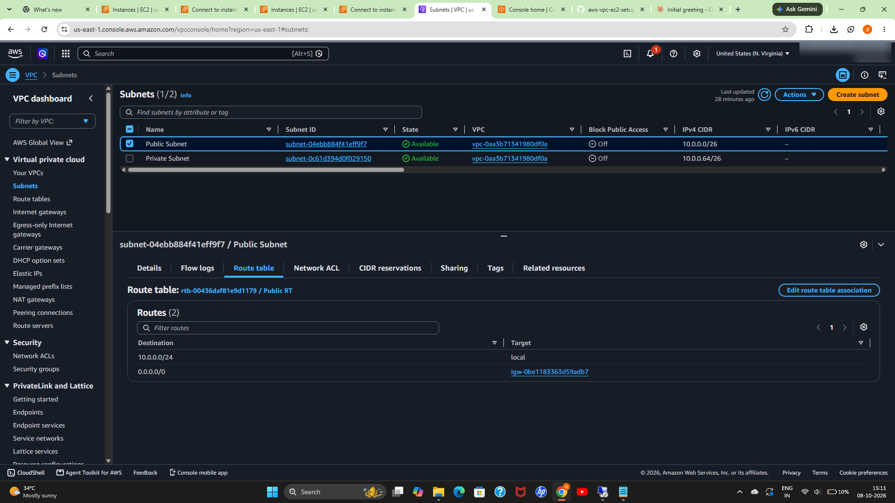
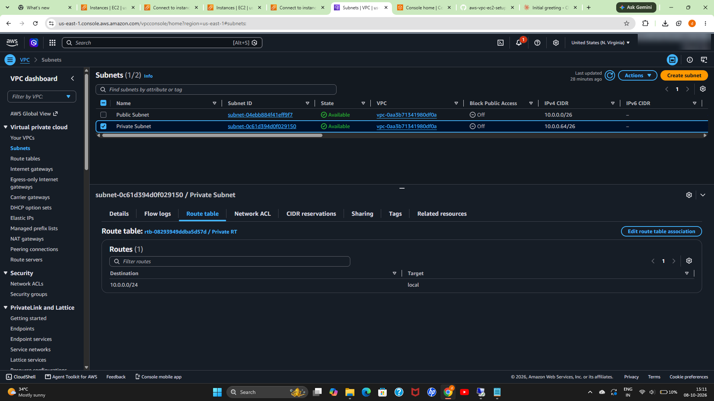

**Internet gateway**

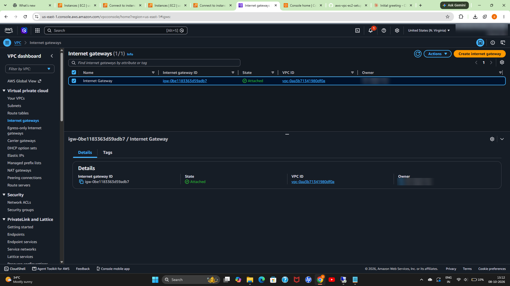

**Route tables**

Public route table, with the `0.0.0.0/0` route to the internet gateway:

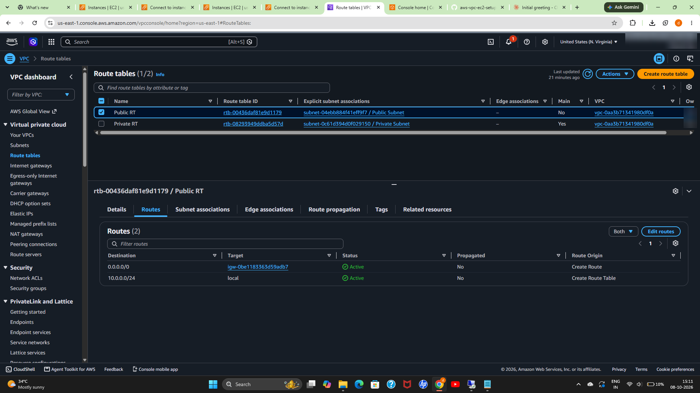
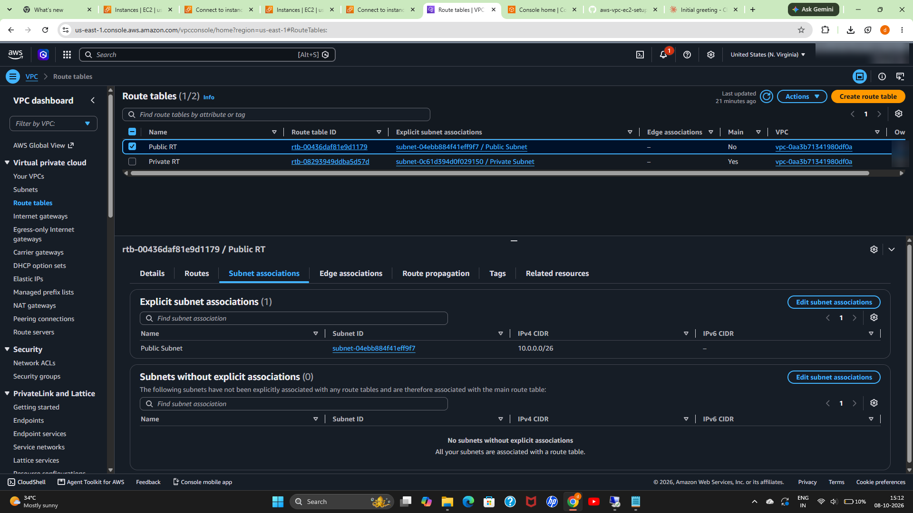

Private route table, local route only:

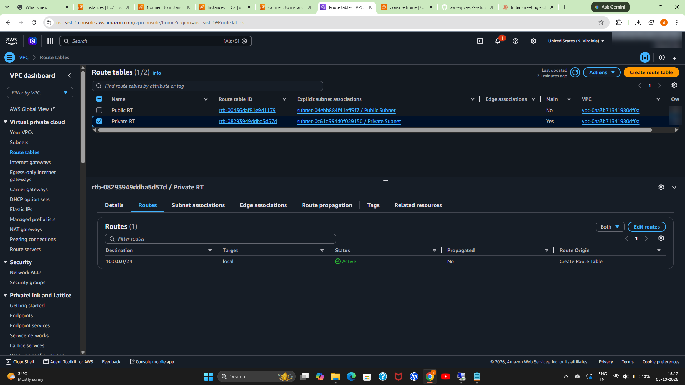
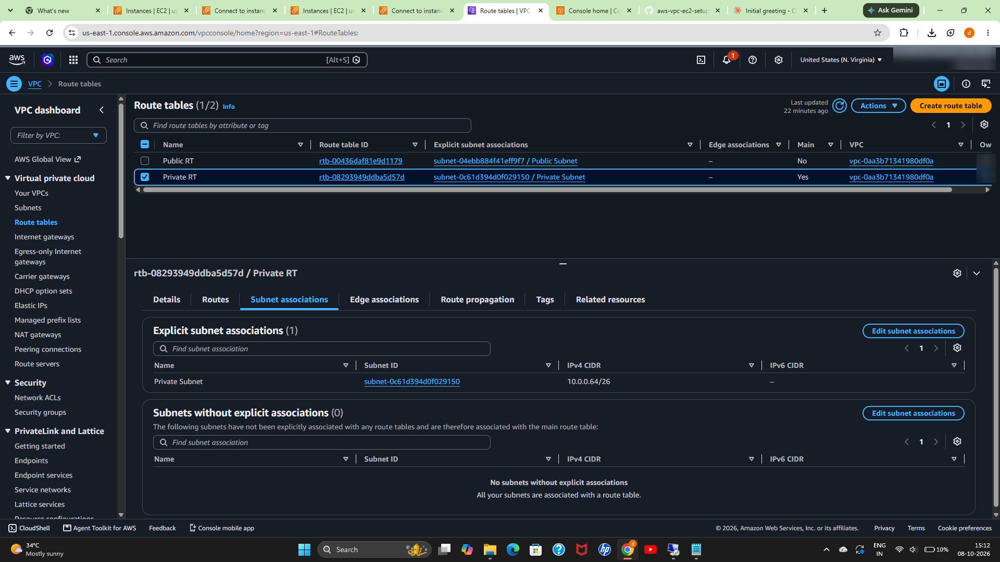

**EC2 instances** (public and private machines, both running)

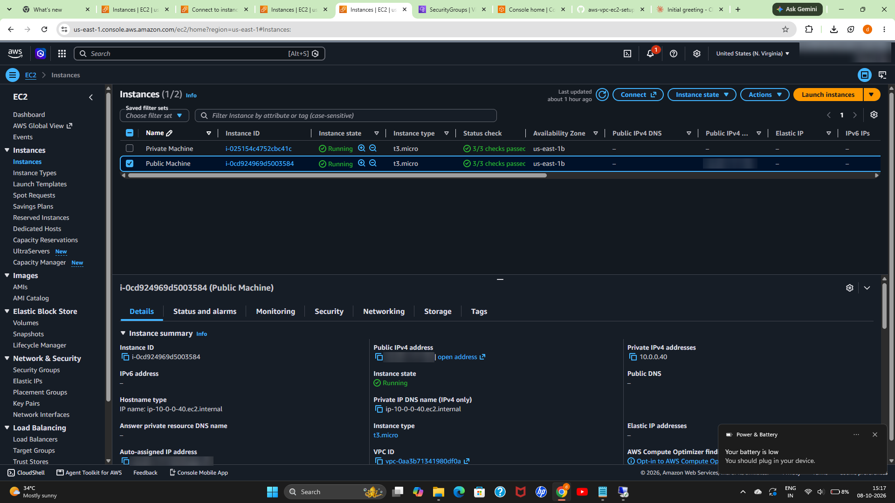

**RDP connection to the public machine**

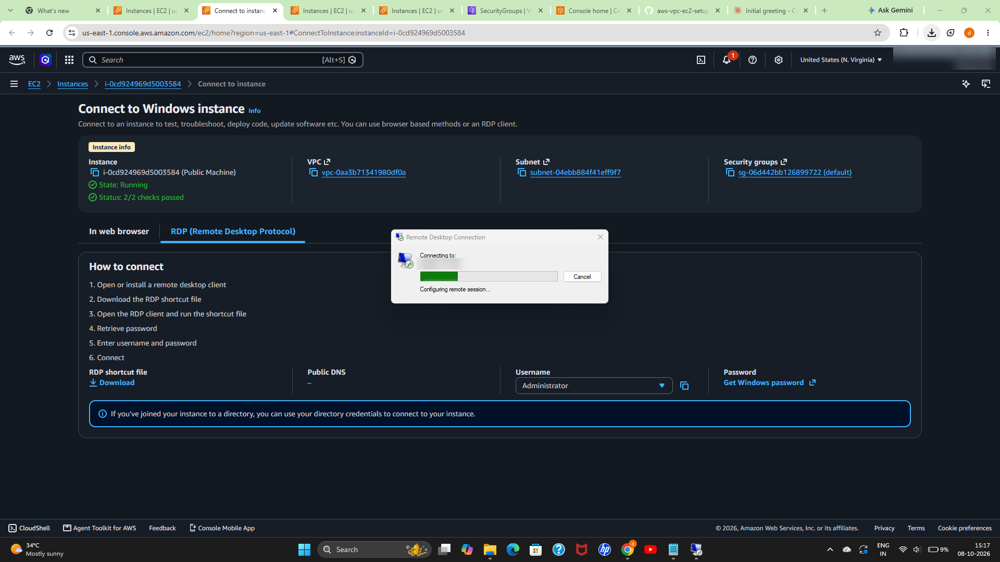

**RDP session on the public machine**

Logged in to the Windows desktop on the public instance. The overlay shows the
private IP `10.0.0.40` (inside the public subnet `10.0.0.0/26`), the instance ID,
instance type `t3.micro` and Availability Zone `us-east-1b`, confirming the
connection reached the right machine.

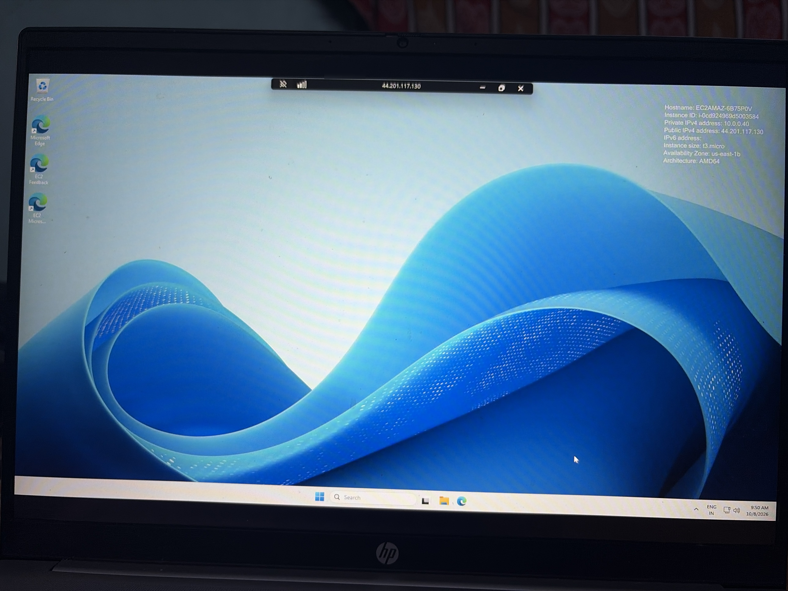

**Security group** (RDP allowed from my IP only)

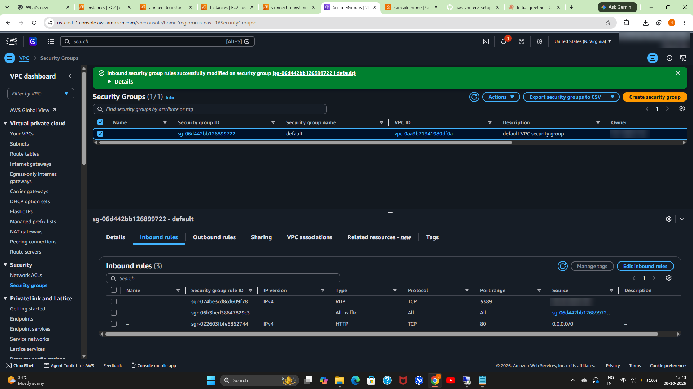

> **Note:** The screenshot also shows an HTTP (port 80) rule open to `0.0.0.0/0`.
> It is not needed for this setup (no web server was running) and was left over
> from testing. In a real environment I would remove it or restrict it, and use
> separate security groups for the public and private machines.

## Possible improvements

- Create the same infrastructure with Terraform.
- Use separate security groups for the public and private machines.
- Add a NAT gateway so the private instance can reach the internet for updates.
- Add an Application Load Balancer and an RDS database in the private subnet.
- Remove unused rules and follow least privilege with separate security groups per tier

## Cleanup

To avoid charges, terminate both EC2 instances and release any Elastic IP when finished. Windows instances and public IPv4 addresses are billed by the hour.
